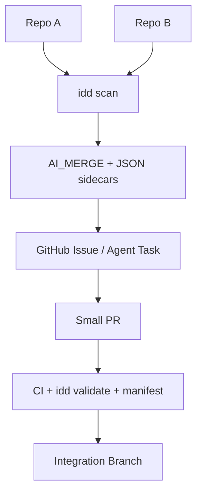

# Architecture

`idd` is intentionally simple and Rust-native:

```text
src/
  cli.rs             # argument parsing and command dispatch
  scanner.rs         # deterministic file inventory and repo signal extraction
  env_contract.rs    # .env and source-code env/secret reference extraction
  planner.rs         # markdown and JSON control-plane generation
  validation.rs      # required-file, workflow-risk, and secret-pattern validation
  manifest.rs        # deterministic FNV-1a file manifesting
  templates.rs       # AGENTS.md, GitHub, task, lock, provider templates
  model.rs           # shared domain structs
  fs_utils.rs        # stable filesystem helpers and backup-on-overwrite writes
```

## Control-plane model

`idd` does not try to become the AI agent. It creates the material that AI agents need to operate safely:



## Why markdown plus JSON

Markdown is deliberate:

- Git-native
- PR-reviewable
- readable by humans and agents
- easy to diff
- easy to paste into GitHub Issues

JSON sidecars are included for automation:

- reusable by scripts
- easier for tools to parse
- safer for downstream agent orchestration
