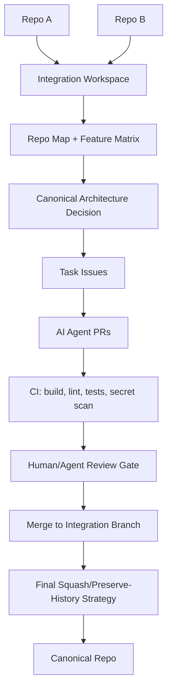

# Clean Roadmap for Unifying two Repos

## Bottom line

The latest practical pattern is **not** “ask one AI to merge two repos.” That is how you get repo soup.

The current best approach is:

> **Create a temporary integration repo / branch, import both repos with history preserved, generate a repo map + feature matrix, then let GitHub-native agents produce small PRs against one canonical target repo.**

GitHub Copilot cloud agent can already research a repo, plan, edit code on a branch, run tests/linters in an ephemeral GitHub Actions-powered environment, and open PRs. It can also resolve merge conflicts. But the key limitation: **Copilot cloud agent can only make changes in the repository specified for the task and can only work on one branch / one PR per task**, so direct multi-repo unification needs orchestration around it. ([GitHub Docs][1])

## The clean architecture for unifying two similar repos

### 1. Make a third “integration” workspace

Use one of these patterns:

| Pattern                                                         | Use when                                                          |
| --------------------------------------------------------------- | ----------------------------------------------------------------- |
| **New integration repo**                                        | Best for major merge/refactor                                     |
| **Primary repo + imported secondary under `/vendor/source-b/`** | Best when one repo is clearly the survivor                        |
| **Git subtree**                                                 | Best when you want history preserved but not submodule pain       |
| **Git submodule**                                               | Avoid unless you truly want two separately versioned products     |
| **Polyrepo orchestrator/metarepo**                              | Best if both repos stay separate but share APIs, env, secrets, CI |

For your example—one repo has an **environment manager**, the other has a **secrets manager**—I would pick:

> **Primary repo + imported secondary under `/imports/<repo-b>/`, then migrate features slice by slice into canonical modules.**

Do **not** immediately flatten the trees.

---

### 2. Generate machine-readable repo maps before any AI edits

Have the agent produce:

```text
/AI_MERGE/
  00_repo_a_inventory.md
  01_repo_b_inventory.md
  02_feature_matrix.md
  03_api_surface_map.md
  04_env_and_secret_contracts.md
  05_conflict_risk_register.md
  06_merge_plan.md
  07_tasks/
```

For env/secrets specifically, force a table like:

| Area              | Repo A                                    | Repo B | Winner | Migration action |
| ----------------- | ----------------------------------------- | ------ | ------ | ---------------- |
| Config schema     | `.env`, TOML, YAML, JSON                  | ...    | ...    | Normalize        |
| Secret source     | GitHub Secrets / Infisical / SOPS / Vault | ...    | ...    | Adapter          |
| Runtime injection | shell, CLI, SDK, env vars                 | ...    | ...    | Keep/replace     |
| Local dev         | direnv/mise/Nix/devcontainer              | ...    | ...    | Standardize      |
| CI                | GitHub Actions                            | ...    | ...    | Rewrite          |
| Secret scanning   | gitleaks/trufflehog/Infisical scan        | ...    | ...    | Enforce          |

This is where most AI repo merges fail: they start editing before they understand the contracts.

---

## AI automation stack I would use today

### GitHub-native orchestration

Use **GitHub Issues + PRs + Actions + branch protection** as the control plane.

GitHub’s current agent stack supports custom instructions, MCP servers, custom agents, hooks, and skills. That matters because repo unification is not one prompt; it is a controlled pipeline with mapping, migration, validation, and rollback. ([GitHub Docs][1])

Recommended control flow:



---

## Repos worth watching right now

These are the strongest candidates for **AI repo automation / codebase migration / agentic PR work**, not generic chatbots.

| Repo                           | Why it matters for repo unification                                                                                                                                                                                                                                                         |
| ------------------------------ | ------------------------------------------------------------------------------------------------------------------------------------------------------------------------------------------------------------------------------------------------------------------------------------------- |
| **OpenHands/OpenHands**        | Strong open-source generalist software-agent platform. The repo is very active, has ~75.7k stars, and the README describes SDK, CLI, local GUI, cloud, multi-agent scale, GitHub/GitLab integration, and sandboxed agent execution. ([GitHub][2])                                           |
| **cline/cline**                | Very relevant for your use case because it has CLI, headless CI/CD mode, Kanban multi-agent task board, worktree-based parallelism, SDK, MCP, rules, skills, hooks, scheduled agents, and local model support. It shows ~62.7k stars and a latest release dated Jun. 1, 2026. ([GitHub][3]) |
| **Aider-AI/aider**             | Best lightweight terminal choice for controlled local repo edits. It maps the codebase, auto-commits, runs lint/tests, works with many cloud/local models, and has ~45.7k stars. Good for disciplined migration commits. ([GitHub][4])                                                      |
| **SWE-agent / mini-SWE-agent** | Better as a research/issue-solving engine than a full merge orchestrator. The SWE-agent repo itself now says most development effort is on **mini-SWE-agent**, which it recommends going forward. ([GitHub][5])                                                                             |
| **GitHub Copilot cloud agent** | Best GitHub-native option for issue-to-branch-to-PR automation. Strong for scoped tasks, not enough by itself for cross-repo orchestration because of the one-repo/one-branch limitation. ([GitHub Docs][1])                                                                                |
| **Claude Code GitHub Action**  | Useful for PR/issue automation, but watch permissions and CI-feedback limitations. A 2026 issue notes that the Claude GitHub App could push branches and trigger CI but lacked `actions:read`, breaking the CI feedback loop unless separately configured. ([GitHub][6])                    |

The bigger 2026 signal: AI coding agents are no longer fringe. A 2026 AIDev paper reports **932,791 agent-authored PRs** across **116,211 GitHub repositories**, produced by agents including Codex, Devin, GitHub Copilot, Cursor, and Claude Code. ([arXiv][7])

---

## Secret + environment manager layer

For your “environment manager + secrets manager” example, keep these separate:

### Secrets manager

Use one canonical backend, not five half-integrated ones.

| Tool          | Best use                                                                                                                                                                                              |
| ------------- | ----------------------------------------------------------------------------------------------------------------------------------------------------------------------------------------------------- |
| **Infisical** | Strong open-source secrets platform with env/project management, secret syncs, dynamic secrets, rotation, scanning, CLI, SDKs, audit logs, and self-hosting. The repo has ~27.2k stars. ([GitHub][8]) |
| **OpenBao**   | Vault-style secret storage/distribution; good if you want self-hosted infra-style secrets. ([GitHub][9])                                                                                              |
| **SOPS**      | Best for encrypted config files committed to Git, especially GitOps/Nix/Kubernetes workflows. ([GitHub][10])                                                                                          |
| **Gitleaks**  | Secret detection/scanning, not secret management. Use it as a guardrail. ([GitHub][11])                                                                                                               |

GitHub also supports repository, environment, and organization secrets, plus environment-specific secret commands via `gh secret set --env`. GitHub’s docs explicitly recommend OIDC where possible so workflows can authenticate to cloud providers without storing long-lived credentials as GitHub secrets. ([GitHub Docs][12])

### Environment manager

Pick one canonical local/dev/CI contract:

```text
.env.example          # documented non-secret variable contract
.env.schema.json      # machine-readable validation
mise.toml / flake.nix # tool versions
.github/workflows     # CI truth
AGENTS.md             # AI instructions
```

My recommendation for your style:

> **Use Nix/mise for toolchain determinism, Infisical or SOPS for secrets, Gitleaks for scanning, GitHub Actions for enforcement, and agent PRs for migration.**

---

## The AI agent task breakdown

Do not tell the agent “merge these repos.” Tell it to execute these issues:

1. **Inventory both repos**

   * File tree
   * Languages
   * build commands
   * package managers
   * entrypoints
   * env vars
   * secret usage
   * CI workflows
   * tests
   * licenses

2. **Create feature matrix**

   * What overlaps
   * What conflicts
   * What is unique
   * Which implementation wins

3. **Define canonical contracts**

   * Config schema
   * secret provider interface
   * env resolution order
   * CLI/API boundaries
   * package layout

4. **Import without flattening**

   * `repo-a/`
   * `repo-b/`
   * `shared/`
   * `migration/`

5. **Migrate one vertical slice at a time**

   * Example: env parser
   * then secret provider adapter
   * then CLI command
   * then CI
   * then docs
   * then deprecation cleanup

6. **Run gates on every PR**

   * build
   * unit tests
   * integration tests
   * lint
   * typecheck
   * dependency audit
   * secret scan
   * generated docs check

---

## Best “right now” workflow

```bash
# 1. Create integration repo
mkdir unified-integration && cd unified-integration
git init

# 2. Add both remotes
git remote add repoA git@github.com:ORG/REPO_A.git
git remote add repoB git@github.com:ORG/REPO_B.git

# 3. Import each repo into its own prefix, preserving history
git subtree add --prefix=imports/repo-a repoA main
git subtree add --prefix=imports/repo-b repoB main

# 4. Create AI workspace
mkdir -p AI_MERGE/tasks shared packages apps
touch AI_MERGE/00_repo_a_inventory.md
touch AI_MERGE/01_repo_b_inventory.md
touch AI_MERGE/02_feature_matrix.md
touch AI_MERGE/03_env_and_secret_contracts.md
touch AI_MERGE/04_merge_plan.md
touch AGENTS.md
```

Then assign agents issue-by-issue. Keep each PR narrow.

---

## The blunt answer

The best current stack for your specific use case:

```text
GitHub Issues/PRs/Actions
+ Copilot cloud agent or Claude Code Action for GitHub-native PR execution
+ Cline/OpenHands for heavier multi-agent orchestration
+ Aider for precise local code migration commits
+ Infisical or SOPS for secrets
+ Gitleaks for enforcement
+ Nix/mise for reproducible environments
+ AGENTS.md + repo maps + feature matrix as agent memory
```

I would **not** trust any single agent to automatically unify two serious repos end-to-end without staged PR gates. The winning pattern is **AI swarm, but serialized merge authority**: many agents can analyze and propose, but only one integration branch accepts changes after CI and conflict checks.

[1]: https://docs.github.com/copilot/concepts/agents/coding-agent/about-coding-agent "About GitHub Copilot cloud agent - GitHub Docs"
[2]: https://github.com/All-Hands-AI/OpenHands "GitHub - OpenHands/OpenHands:  OpenHands: AI-Driven Development · GitHub"
[3]: https://github.com/cline/cline "GitHub - cline/cline: Autonomous coding agent as an SDK, IDE extension, or CLI assistant. · GitHub"
[4]: https://github.com/Aider-AI/aider "GitHub - Aider-AI/aider: aider is AI pair programming in your terminal · GitHub"
[5]: https://github.com/SWE-agent/SWE-agent "GitHub - SWE-agent/SWE-agent: SWE-agent takes a GitHub issue and tries to automatically fix it, using your LM of choice. It can also be employed for offensive cybersecurity or competitive coding challenges. [NeurIPS 2024] · GitHub"
[6]: https://github.com/anthropics/claude-code-action/issues/1014 "[FEATURE] Add actions:read permission to claude.ai/code GitHub App for workflow run feedback · Issue #1014 · anthropics/claude-code-action · GitHub"
[7]: https://arxiv.org/abs/2602.09185?utm_source=chatgpt.com "AIDev: Studying AI Coding Agents on GitHub"
[8]: https://github.com/Infisical/infisical "GitHub - Infisical/infisical: Infisical is the open-source platform for secrets, certificates, and privileged access management. · GitHub"
[9]: https://github.com/openbao/openbao "GitHub - openbao/openbao: OpenBao is a software solution to manage, store, and distribute sensitive data including secrets, certificates, and keys. · GitHub"
[10]: https://github.com/getsops/sops "GitHub - getsops/sops: Simple and flexible tool for managing secrets · GitHub"
[11]: https://github.com/gitleaks/gitleaks "GitHub - gitleaks/gitleaks: Find secrets with Gitleaks  · GitHub"
[12]: https://docs.github.com/en/actions/security-for-github-actions/security-guides/using-secrets-in-github-actions "Using secrets in GitHub Actions - GitHub Docs"
